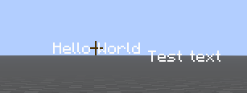
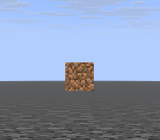
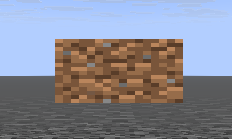
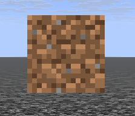

In Marmot, you can create UIs to be serialized and sent to the client.
| ⚠️ | Due to Marmot's age, some things may be buggy and not work properly. We are working on solving these issues as fast as possible.
|-|-|

In Kotlin, a UI can be created like this:
```kt
class TestUI : MarmotUI("test_ui") {
  fun new() {}
}
```
| ‼️ | Because of the layout-based nature of Marmot's UI system, you must add components into groups. |
|----|------------------------------------------------------------------------------------------------|

Most of the time, a component expects an ID in its first parameter.
Using duplicate IDs **will** cause issues, so make sure to look out for that.

Inside the `new()` function, you can add components:
```kt
class TestUI : MarmotUI("test_ui") {
  fun new() {
    group("test_group") {
      text("test_text") {
        text = "Hello World"
        anchor = Anchor.CENTER_CENTER // horizontal_vertical
      }
    }
  }
}
```

In order to send a UI to a player/audience, you must do this:
```kt
val ui = TestUI()
player/audience.openUI(ui.new())
```

## Animations

Marmot also supports UI animations, for example:
```kt
class TestUI : MarmotUI("test_ui") {
  fun new() {
    group("test_group") {
      val text1 = text("test_text") {
        text = "Hello World"
        anchor = Anchor.CENTER_CENTER // horizontal_vertical
      }
      
      text1.schedule(20) { // 20 ticks from now
        // You can run multiple animations at once, hence the list.

        // This will move the text to 50,50 from the player's crosshair
        // (since it's anchored to CENTER_CENTER), and reduce its opacity
        // to 0.5 (50%) over the course of 0.5 seconds.
        listOf(
          move(
            to = Vec2(50f, 50f),
            duration = 0.5,
            easing = Easing.LINEAR
          ),
          opacity(
            opacity = 0.5f,
            duration = 0.5,
            easing = Easing.EASE_IN_OUT
          )
        )
      }
    }
  }
}
```

### Easing
Marmot currently supports **24** easing variants:

```kt
enum class Easing {
    LINEAR,
    EASE_IN,
    EASE_OUT,
    EASE_IN_OUT,
    EASE_IN_CUBIC,
    EASE_OUT_CUBIC,
    EASE_IN_OUT_CUBIC,
    EASE_IN_QUINT,
    EASE_OUT_QUINT,
    EASE_IN_OUT_QUINT,
    EASE_IN_BACK,
    EASE_OUT_BACK,
    EASE_IN_OUT_BACK,
    EASE_IN_ELASTIC,
    EASE_OUT_ELASTIC,
    EASE_IN_OUT_ELASTIC,
    EASE_OUT_BOUNCE,
    EASE_IN_BOUNCE,
    EASE_IN_OUT_BOUNCE,
    EASE_IN_SINE,
    EASE_OUT_SINE,
    EASE_IN_OUT_SINE,
    EASE_IN_EXPO,
    EASE_OUT_EXPO,
    EASE_IN_OUT_EXPO
}
```

Most of these can be found and visualized [here](https://easings.net/), and you can also see how they work [here](https://github.com/zNotChill/marmot/blob/b42b2780c162fe57dccfa7c76954669d617a0497/mod/src/client/kotlin/me/znotchill/marmot/client/ui/UIRenderer.kt#L170) on the client.

You can also nest schedulers inside each other, which could look something like this: (**before 1.2.12, this functionality was broken!**)
```kt
text1.schedule(20) { // 20 ticks from now
    text2.schedule(5) { // 25 ticks from now
        text3.schedule(50) { // 75 ticks from now
            
        }
        
        text4.schedule(10) { // 35 ticks from now
            
        }
    }
}
```

## Relative Positioning

Components can be placed relatively to each other in Marmot.

| ⚠️ | Due to Marmot's age, relative positioning is still a work in progress, however, left and right positioning are functional. |
|----|----------------------------------------------------------------------------------------------------------------------------|

When components are relative, the `pos` still works as expected, adding the `pos` onto the relative position.

Example:
```kt
class TestUI : MarmotUI("test_ui") {
  fun new() {
    group("test_group") {
      val text1 = text("test_text") {
        text = "Hello World"
        anchor = Anchor.CENTER_CENTER // horizontal_vertical
      }
      val text2 = text("test_text_2") {
        text = "Test text"
      } rightOf text1
    }
  }
}
```

The result:


------

You can also give any component padding, and text components background and text color:

```kt
class TestUI : MarmotUI("test_ui") {
  fun new() {
    group("test_group") {
      val text1 = text("test_text") {
        text = "Hello World"
        anchor = Anchor.CENTER_CENTER // horizontal_vertical
      }
      val text2 = text("test_text_2") {
        text = "Test text"
        /* 
          You can control the padding more strictly.
          For example:
          padding = Spacing(x = 5) // applies 5 pixels of padding on the left and right
          padding = Spacing(left = 5, right = 5) // works the same as x = 5

          padding = Spacing(y = 5) // applies 5 pixels of padding on the top and bottom
          padding = Spacing(top = 5, bottom = 5) // works the same as y = 5
        */
        padding = Spacing(5) // applies 5 pixels of padding on every axis
        
        backgroundColor = UIColor(255, 255, 255)
        color = UIColor(0, 0, 0)
      } rightOf text1
    }
  }
}
```

## Sprites (textures)

In Marmot, sprites are very easy to add:
```kt
class TestUI : MarmotUI("test_ui") {
  fun new() {
    group("test_group") {
      val sprite = sprite("test_sprite") {
        texturePath = "textures/block/dirt.png"
      }
    }
  }
}
```
| ‼️ | As of now, the `.png` is still required, but will definitely be optional in a future update. |
|----|----------------------------------------------------------------------------------------------|

| ℹ️ | The `texturePath` is simply a path to a resource. You can add a custom namespace like `my_pack:textures/item/something_cool.png` from a resource pack. The namespace defaults to `minecraft` if one is not found. |
|----|-------------------------------------------------------------------------------------------------------------------------------------------------------------------------------------------------------------------|

The result:


------

The size on the X and Y can also be controlled, stretching the image unless you scale by the same value on both axes:
```kt
val sprite = sprite("test_sprite") {
  texturePath = "textures/block/dirt.png"
  size = Vec2(64f, 32f)
}
```

The result:


```kt
val sprite = sprite("test_sprite") {
  texturePath = "textures/block/dirt.png"
  size = Vec2(64f, 64f)
}
```

The result:


## Gradients

In Marmot, you can create a UI Gradient using two UIColors.
At this moment, gradients do not support custom angles.

Example:
```kt
gradient("gradient") {
    fillScreen = true // size the component to the client's viewport
    anchor = Anchor.TOP_LEFT // anchor the component to the TOP_LEFT, required for fillScreen components
    from = UIColor(255, 255, 255)
    to = UIColor(0, 0, 0)
}
```

## Boxes

In Marmot, you can create a UI Box using one solid UIColor.

Example:
```kt
box("box") {
    fillScreen = true // size the component to the client's viewport
    anchor = Anchor.TOP_LEFT // anchor the component to the TOP_LEFT, required for fillScreen components
    color = UIColor(100, 100, 100)
}
```
```kt
box("box") {
    color = UIColor(100, 100, 100)
    size = Vec2(50f, 50f)
}
```

## Lines

In Marmot, you can create a UI Line, which displays a straight line.

Example:
```kt
line("line") {
    from = Vec2(-20f, 0f)
    to = Vec2(20f, 0f)
    pointSize = Vec2(2f, 2f) // the size of each sample point in the line
    pos = Vec2(0f, 20f)
    anchor = Anchor.BOTTOM_CENTER
    color = UIColor(255, 0, 0)
}
```

This should result in a red line directly above the hotbar.