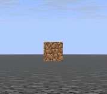
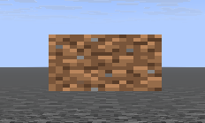
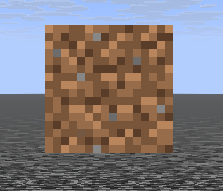

## Sprites (textures)

In Marmot, sprites are very easy to add:
```kt
class TestUI : MarmotUI("test_ui") {
  fun new() {
    group("test_group") {
      val sprite = sprite("test_sprite") {
        texturePath = "textures/block/dirt.png"
      }
    }
  }
}
```

:::danger
As of now, the `.png` is still required, but will definitely be optional in a future update.
:::

:::tip
The `texturePath` is simply a path to a resource. You can add a custom namespace like `my_pack:textures/item/something_cool.png` from a resource pack. The namespace defaults to `minecraft` if one is not found.
:::

The result:


------

The size on the X and Y can also be controlled, stretching the image unless you scale by the same value on both axes:
```kt
val sprite = sprite("test_sprite") {
  texturePath = "textures/block/dirt.png"
  size = Vec2(64f, 32f)
}
```

The result:


```kt
val sprite = sprite("test_sprite") {
  texturePath = "textures/block/dirt.png"
  size = Vec2(64f, 64f)
}
```

The result:
