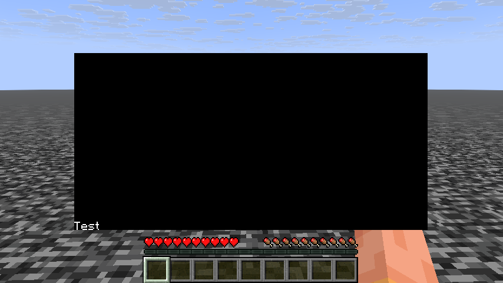

Components can be placed relatively to each other in Marmot.

:::caution
Due to Marmot's age, relative positioning is still a work in progress, however, left and right positioning are functional.
:::

When components are relative, the `pos` still works as expected, adding the `pos` onto the relative position.

Example:
```kt
class TestUI : MarmotUI("test_ui") {
  fun new() {
    group("test_group") {
      val text1 = text("test_text") {
        text = "Hello World"
        anchor = Anchor.CENTER_CENTER // horizontal_vertical
      }
      val text2 = text("test_text_2") {
        text = "Test text"
      } rightOf text1
    }
  }
}
```

The result:


## Component-relative Positioning

As of client 1.2.14, component-relative positioning works as expected:

Example:
```kt
group("group") {
    val background = box("background") {
        anchor = Anchor.CENTER_CENTER
        color = UIColor(0, 0, 0)
        opacity = 1f
        size = Vec2(300f, 150f)
    }
    text("test") {
        anchor = Anchor.BOTTOM_LEFT
        color = UIColor(255, 255, 255)
        text = "Test"
    } relative background
}
```

✅ Produces:


❌ Before 1.2.14:


------

You can also give any component padding, and text components background and text color:

```kt
class TestUI : MarmotUI("test_ui") {
  fun new() {
    group("test_group") {
      val text1 = text("test_text") {
        text = "Hello World"
        anchor = Anchor.CENTER_CENTER // horizontal_vertical
      }
      val text2 = text("test_text_2") {
        text = "Test text"
        /* 
          You can control the padding more strictly.
          For example:
          padding = Spacing(x = 5f) // applies 5 pixels of padding on the left and right
          padding = Spacing(left = 5f, right = 5f) // works the same as x = 5

          padding = Spacing(y = 5f) // applies 5 pixels of padding on the top and bottom
          padding = Spacing(top = 5f, bottom = 5f) // works the same as y = 5
        */
        padding = Spacing(5f) // applies 5 pixels of padding on every axis
        
        backgroundColor = UIColor(255, 255, 255)
        color = UIColor(0, 0, 0)
      } rightOf text1
    }
  }
}
```
